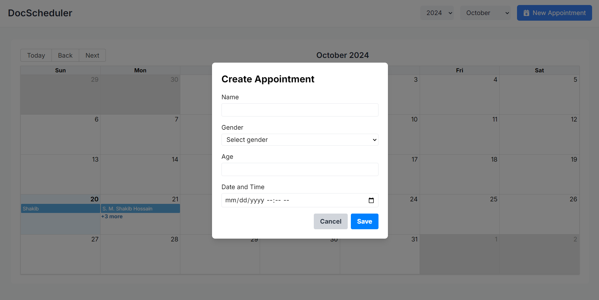
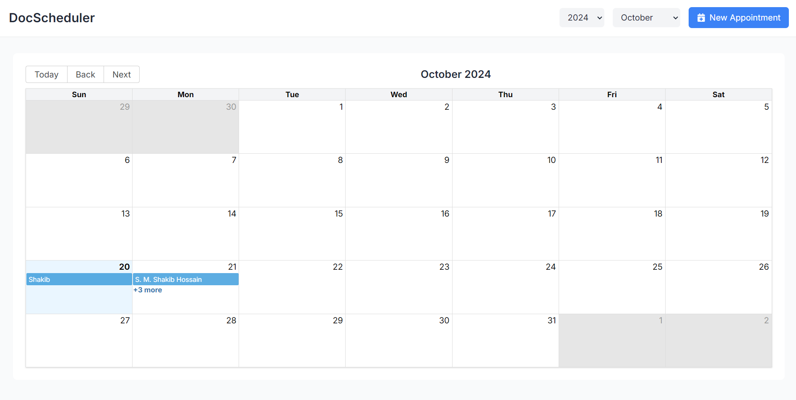
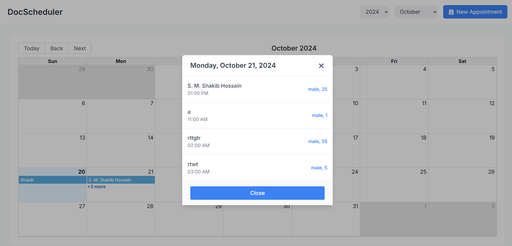
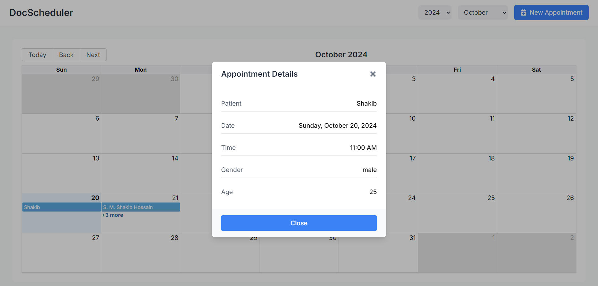

# Doctor Appointment Calendar

A React-based Doctor Appointment Calendar application that displays a monthly view of appointments. The app allows users to create, view, and manage appointments, with data stored in local storage for persistence. React Router is used to change the calendar view by year and month, and Redux is employed for state management.

## UI






## Table of Contents

- [Introduction](#introduction)
- [Features](#features)
- [Technologies Used](#technologies-used)
- [Installation](#installation)
- [Usage](#usage)
- [State Management (Redux)](#state-management-redux)
- [Data Persistence](#data-persistence)
- [Components Overview](#components-overview)
  - [App Component](#app-component)
  - [Header Component](#header-component)
  - [Calendar Component](#calendar-component)
  - [Appointment Modal Component](#appointment-modal-component)
  - [Create Appointment Modal Component](#create-appointment-modal-component)
- [Routing](#routing)
- [Form Handling](#form-handling)
- [License](#license)

## Introduction

The Doctor Appointment Calendar is a simple appointment scheduling app where users can view appointments in a monthly calendar layout, create new appointments, and view details of existing ones. The data is persisted using local storage, ensuring the state is saved across page reloads.

## Features

- **Monthly Calendar View**: Displays a fixed-size grid for each month, with appointments listed on their respective days.
- **Appointment Creation**: Users can add appointments by clicking the 'Create Appointment' button.
- **Appointment Details**: Clicking on an appointment opens a modal showing detailed information.
- **Routing**: Dynamically change the calendar view by selecting different months and years via the dropdowns or URL.
- **State Management**: Uses Redux to manage global state for appointments and calendar settings.
- **Data Persistence**: Appointments are persisted in the browser using local storage.

## Technologies Used

- **React**: For building the user interface.
- **React Router**: For navigation and dynamic routing.
- **Redux**: For managing global state.
- **React Hook Form**: For managing form inputs and validation.
- **Local Storage**: For persisting appointment data.
- **CSS Grid**: For building the calendar layout.
- **JavaScript ES6**: For modern JavaScript features.

## Installation

1. Clone the repository:
   ```bash
   git clone https://github.com/yourusername/doctor-appointment-calendar.git
   cd doctor-appointment-calendar
   ```
